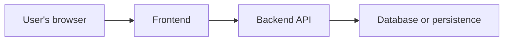

# Architecture boundary

The product scope and stack are undecided. This document states boundaries rather
than claiming an implementation exists.

The frontend owns presentation and browser interaction. The backend owns trusted
validation, authorization, business rules, and persistence. Browser validation
improves usability but never replaces server-side validation or authorization.

Frontend and backend live in one repository and may deploy independently. Avoid
importing backend internals directly into the frontend. Define a versioned API
contract; OpenAPI is an option for different languages, while a shared schema
package may suit TypeScript throughout. Share code only when a real common need
exists. Validate untrusted input at runtime even if types are shared.

Keep environments and secrets separate. Database migrations and synthetic seed
data belong in version control. Production data and credentials do not.

Record language/framework, API-contract, database, authentication, hosting, and
package-manager choices in decision records before adding their infrastructure.
