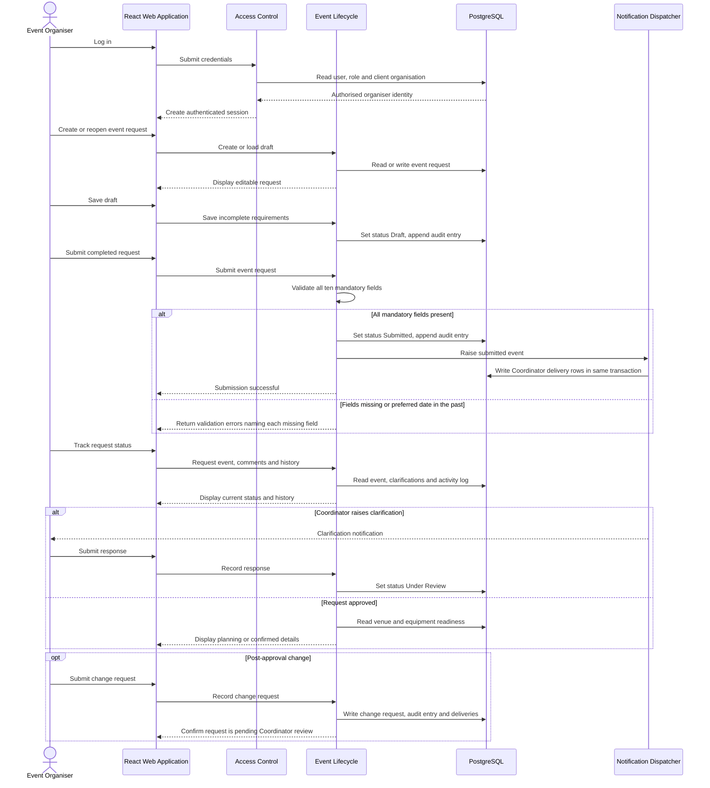
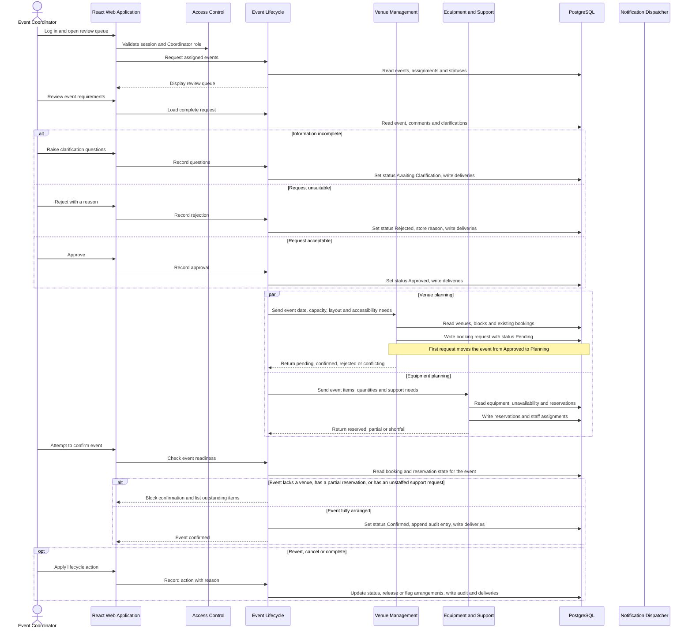
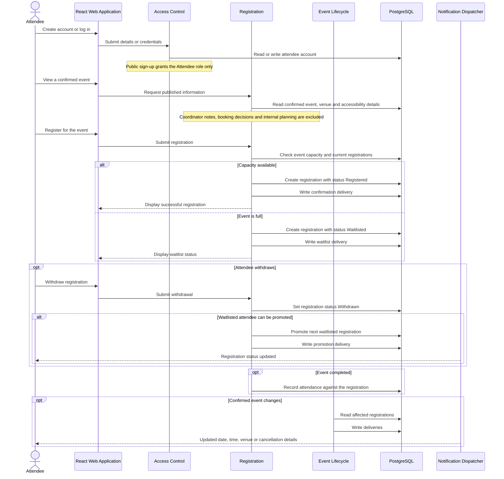

## Architecture Modular Monolith User Flow (Revised)
## 8. Dynamic view — Event Organiser



## 9. Dynamic view — Event Coordinator



## 10. Dynamic view — Venue Staff

```mermaid
sequenceDiagram
    actor VS as Venue Staff
    participant UI as React Web Application
    participant IAM as Access Control
    participant VEN as Venue Management
    participant EVT as Event Lifecycle
    participant DB as PostgreSQL
    participant NOT as Notification Dispatcher

    VS->>UI: Log in
    UI->>IAM: Validate session and Venue Staff role

    VS->>UI: Maintain venue catalogue
    UI->>VEN: Save capacity, layouts, accessibility features and facilities
    VEN->>DB: Write venue, layouts and feature links, append audit entry

    opt Venue unavailable
        VS->>UI: Record maintenance period
        UI->>VEN: Create venue block
        VEN->>DB: Write block
        alt Block overlaps a confirmed booking
            VEN-->>UI: Warn and require conflict to be resolved first
        else No overlap
            VEN->>DB: Write deliveries for affected Coordinators
        end
    end

    VS->>UI: Open a pending booking request
    UI->>VEN: Load event requirements and venue
    VEN->>DB: Read event, requirements and venue state

    VS->>UI: Review suitability and availability
    VEN->>DB: Read capacity, layouts, features, operating hours, blocks and bookings
    Note over VEN: Suitability is advisory; the decision remains with Venue Staff

    alt Approve
        UI->>VEN: Approve booking request
        VEN->>DB: Set booking status Confirmed
        Note over VEN,DB: EXCLUDE constraint rejects overlapping confirmed bookings
        alt Constraint violation, another approval won
            VEN-->>UI: Report that the venue has just been taken
        else Written successfully
            VEN->>DB: Flag competing pending requests as conflicting
            VEN-->>EVT: Return confirmed booking
            VEN->>DB: Write Coordinator deliveries
        end
    else Reject
        UI->>VEN: Reject with reason and optional alternative venue
        VEN->>DB: Set booking status Rejected, store reason and suggestion
        VEN-->>EVT: Return rejection so Coordinator can amend the request
    end
```

## 11. Dynamic view — Technical Support Staff

```mermaid
sequenceDiagram
    actor TS as Technical Support Staff
    participant UI as React Web Application
    participant IAM as Access Control
    participant EQ as Equipment and Support
    participant EVT as Event Lifecycle
    participant DB as PostgreSQL
    participant NOT as Notification Dispatcher

    TS->>UI: Log in
    UI->>IAM: Validate session and Technical Support role

    TS->>UI: Maintain equipment catalogue
    UI->>EQ: Save type, description, quantity, location and operational status
    EQ->>DB: Write equipment, append audit entry

    TS->>UI: Open an equipment request
    UI->>EQ: Load requested items, quantities and event times
    EQ->>DB: Read request and event

    TS->>UI: Check availability
    EQ->>DB: Read total quantity, overlapping reservations and dated unavailability
    Note over EQ: Location does not affect availability; no transit allowance applies

    alt Full quantity available
        TS->>UI: Reserve equipment
        EQ->>DB: Write reservation with status Reserved
        EQ-->>EVT: Return reserved
    else Only part available
        TS->>UI: Record partial reservation
        EQ->>DB: Write reservation with status Partial
        EQ->>DB: Write Coordinator deliveries stating outstanding quantity
        EQ-->>EVT: Return shortfall, which blocks confirmation
    end

    opt Event requested technical support
        TS->>UI: Assign an available colleague
        UI->>EQ: Record assignment
        EQ->>DB: Write assignment
        Note over EQ,DB: EXCLUDE constraint rejects overlapping assignments for the same colleague
    end

    opt Item damaged or entering maintenance
        TS->>UI: Mark item unavailable for a period with a reason
        EQ->>DB: Write dated unavailability row
        EQ->>DB: Flag affected events and write Coordinator deliveries
        Note over EQ,DB: Existing reservations are flagged, never released automatically
    end
```

## 12. Dynamic view — Attendee


