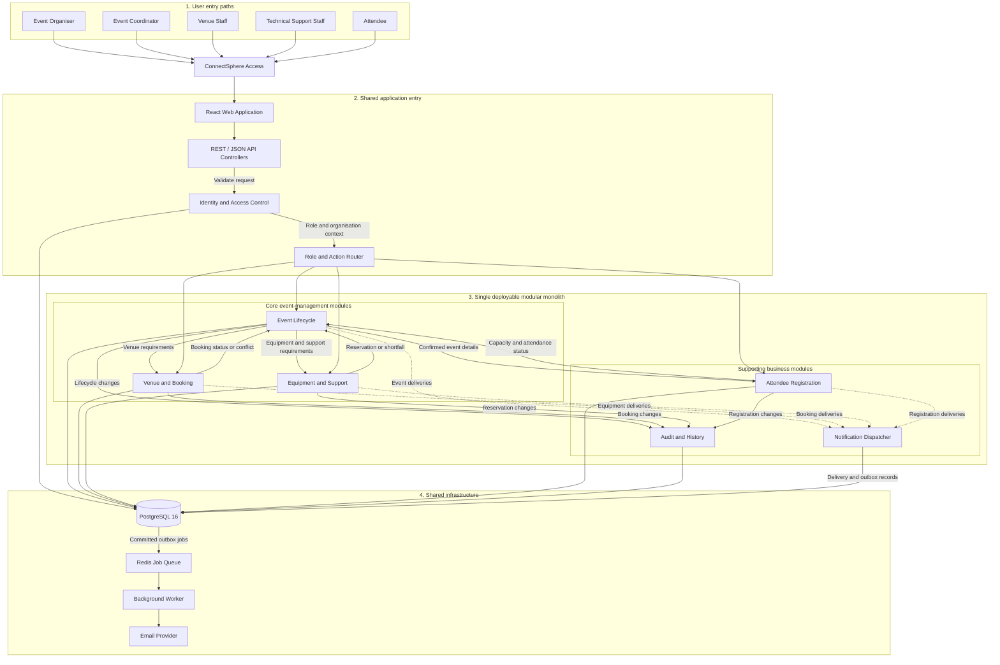

# ConnectSphere Modular Monolith Architecture

## Architecture overview

ConnectSphere is implemented as a single deployable modular monolith. All users enter through one React web application and a shared API layer. The application is separated internally into business modules with clearly defined responsibilities, while PostgreSQL and the notification infrastructure are shared.

Each event request represents one event session with its own date, time, venue, equipment, approval and registration arrangements. If an organiser plans multiple sessions, a separate event request must be created for each session.

## Module responsibilities

| Layer | Component | Main responsibility |
|---|---|---|
| User access | React Web Application | Provides a shared interface for all five user roles. |
| Application entry | API Controllers | Receives REST/JSON requests and routes them into the application. |
| Security | Identity and Access Control | Authenticates users and retrieves their role and organisation context. |
| Security | Role and Action Router | Allows users to access only the actions permitted for their role. |
| Business module | Event Lifecycle | Manages event drafts, submission, review, clarification, approval, planning, confirmation, cancellation and completion. |
| Business module | Venue and Booking | Maintains venue information, venue blocks, booking requests, suitability checks and booking conflicts. |
| Business module | Equipment and Support | Maintains equipment, checks availability, creates reservations, identifies shortfalls and assigns technical staff. |
| Business module | Attendee Registration | Publishes confirmed event information and manages registration, capacity, waitlists, withdrawal and attendance. |
| Supporting module | Audit and History | Records important user actions and changes to business records. |
| Supporting module | Notification Dispatcher | Creates and processes notification deliveries arising from business events. |
| Shared infrastructure | PostgreSQL 16 | Stores users, events, bookings, equipment, registrations, audit history and notification delivery records. |
| Shared infrastructure | Redis Job Queue | Queues committed notification jobs for asynchronous processing. |
| Shared infrastructure | Background Worker | Processes queued notification jobs outside the main user request. |
| External service | Email Provider | Delivers confirmation, clarification, waitlist and change-notification emails. |

## Role-to-module access

| User role | Primary modules used |
|---|---|
| Event Organiser | Identity and Access Control, Event Lifecycle, Notification Dispatcher |
| Event Coordinator | Identity and Access Control, Event Lifecycle, Venue and Booking, Equipment and Support, Notification Dispatcher |
| Venue Staff | Identity and Access Control, Venue and Booking, Event Lifecycle, Notification Dispatcher |
| Technical Support Staff | Identity and Access Control, Equipment and Support, Event Lifecycle, Notification Dispatcher |
| Attendee | Identity and Access Control, Attendee Registration, Event Lifecycle, Notification Dispatcher |

## Architectural interpretation

- The system is deployed as one application rather than as independent microservices.
- Each module owns a distinct business responsibility and communicates with other modules through defined application-level interactions.
- The modules share one PostgreSQL database but should keep their business logic separated.
- Venue and equipment readiness determine whether an approved event can be confirmed.
- Notifications are handled asynchronously through committed outbox records, Redis and a background worker.
- Audit records preserve the history of significant actions across the business modules.
