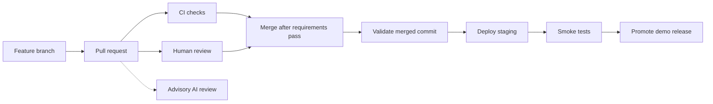

# ConnectSphere repository setup and engineering guide

This document records the team's initial repository plan and explains how to grow
it into a frontend/backend web application. It is intended for teammates who were
not part of the setup discussion.

The product scope and application stack are still undecided. The repository
foundation is useful independently of those decisions.

## 1. What we adopted from the reference approach

The reference workflow separates local checks, pull-request CI, advisory AI review,
and human approval. It documents branch and commit conventions, installs hooks
through one setup command, and keeps verification evidence in PRs.

We adopted those principles. Its Python application tools and AWS deployment
scripts are specific to that project, so the application configuration here will
be selected when our team knows its requirements.

## 2. Current scope and what remains

| Capability | Initial state |
| --- | --- |
| Monorepo boundaries and contributor guide | Implemented |
| Commit, commit-message, and pre-push hooks | Implemented; each clone runs setup |
| Whitespace, syntax, conflict, case, file-size, key/secret checks | Implemented locally and in CI |
| Branch and conventional PR-title validation | Implemented; title edits rerun CI |
| Tests of repository tooling | Implemented; not application tests |
| Dependency update bot | Dependabot configured for Actions and tooling |
| Human review routing | Shared CODEOWNERS configured |
| Required approvals, required checks, squash-only merging | Prepared; owner must activate |
| AI reviewer | CodeRabbit settings prepared; App installation still required |
| Frontend/backend languages and frameworks | Undecided |
| Application lint, types, unit/integration/E2E tests, builds | Add with real application code |
| Hosting, staging, production/demo delivery, rollback | Plan below; not deployed |
| License | Team/course decision outstanding |

The CI check names describe their scope. A green repository check must never be
reported as a passing application build, passing application tests, or a successful
deployment. For a runnable app, the absence of expected tests should fail its test
job. No placeholder application test job exists in this foundation.

## 3. Monorepo structure and boundaries

```text
frontend/             Browser application and component tests
backend/              API, business logic, backend tests, migrations
tests/e2e/            Whole-application browser journeys
tooling/              Repository-tool dependencies and their own tests
scripts/              Shared setup and check entry points
docs/                 Architecture, engineering guide, and decisions
.github/              CI, ownership, templates, dependency updates, settings
```

Add `src/`, application tests, and migrations when they exist rather than creating
empty directories that imply implemented behaviour. Frontend and backend may
deploy separately despite sharing a repository.

Each application has an explicit dependency/configuration boundary. Use one package
manager per ecosystem and commit its lockfile. For JavaScript on both sides, root
workspaces can coordinate installation and commands. For a Python backend, keep
its manifest and environment separate from frontend dependencies and the
repository's `.venv-tools/` environment.

Define the frontend/backend API contract early. OpenAPI suits different languages;
a shared contract/schema package can help a TypeScript stack. Shared types do not
replace server-side input validation. Do not share backend implementation code or
secrets with the frontend. Add shared packages only when real reuse warrants them.

Prefer consistent folder/file names and follow the selected framework's idioms.
For example, JavaScript component naming and Python module naming need not be
forced into the same convention. Avoid names differing only by case, since team
members and CI may use different operating systems.

## 4. Reproducible contributor setup

Prerequisites are Git and Python 3.12+. Python is a repository-tooling dependency,
not the application's backend decision. Run from the repository root:

```text
python scripts/setup.py
git add <intended-files>
python scripts/check.py
```

Use `python3` on macOS/Linux or `py -3.12` on Windows if appropriate. Setup creates
an isolated virtual environment, installs the pinned pre-commit version, and
installs hooks. It preserves existing inherited hooks through forwarding scripts
and pre-commit migration mode. Global Git configuration and packages are unchanged.
If existing hook destinations conflict, it stops before replacing them.

Run setup after each clone and after moving a checkout. A virtual environment
contains machine-specific paths and must not be shared or committed. Each machine
should have its own clone; simultaneous use of one network-share clone can race
on Git's index, hooks, and the environment. Windows/UNC paths are supported by the
Python commands, but a local clone is preferable for performance and isolation.
Local clones use `.venv-tools/`; Windows UNC clones use a per-clone directory in
`%LOCALAPPDATA%/ConnectSphere/tooling/`. Setup prints the directory, and the check
script selects it automatically. This keeps tool installation off the network share.

`.editorconfig` sets editor defaults. `.gitattributes` normalises text to LF while
keeping Windows command files at CRLF. `.gitignore` excludes secrets, dependencies,
caches, databases, and generated outputs. Configuration examples must contain
placeholders; add them when the actual variables are known.

## 5. Branches, commits, and history

Use one stable `main` branch and short-lived purpose-based branches. A separate
long-lived `develop` or `staging` branch is unnecessary unless a release process
later requires it. Environments can deploy from the same versioned history.

| Change | Branch | Commit / PR title |
| --- | --- | --- |
| Feature | `feature/42-user-profile` | `feat(frontend): add profile form` |
| Bug fix | `fix/57-empty-form-submit` | `fix(backend): reject invalid dates` |
| Tooling | `chore/setup-ci` | `ci: add repository checks` |
| Documentation | `docs/onboarding` | `docs: explain local setup` |

Branch suffixes use lowercase letters, digits, and single hyphens; include an
issue number when available. The allowed prefixes and commit types are listed in
[CONTRIBUTING.md](../CONTRIBUTING.md). The conventional title limit is 100 characters.
Scopes are optional; `frontend`, `backend`, and `deps` are useful examples.

Local commit messages are validated. CI validates PR titles so the final squash
commit can carry a clear summary even when a branch has intermediate commits.
The owner setup selects PR titles as squash commit titles and disables other merge
methods. Preserve issue/PR evidence for assessment, and check the course's policy
if individual commit histories or AI contributions affect marking.

The first empty-repository bootstrap is pushed directly to `main`. Subsequent
feature work should use reviewed PRs once the owner activates protection. The
local main-push notice does not constitute server-side enforcement.

## 6. Hooks, linting, formatting, and types

| Layer | Checks | Reason |
| --- | --- | --- |
| Editor | Formatting and diagnostics once stack is selected | Immediate feedback |
| Pre-commit | Changed-file hygiene and secret detection | Keep commits clean and fast |
| Commit message | Conventional title | Readable history |
| Pre-push | Branch naming now; fast app checks later | Catch mistakes before upload |
| Pull-request CI | Full tracked-file checks and tooling tests now | Independent repeatable evidence |
| Merge rules | Required CI and one human approval | Enforce team policy on GitHub |

Hooks are bypassable. Every essential correctness or security check must also run
in CI. Normal commit hooks should take seconds after installation. Avoid putting
network-dependent tests, full browser suites, or deployments in commit hooks.

The single hook manager is pre-commit. It works across languages. For an entirely
JavaScript team, Husky with lint-staged is an alternative; adopting it later must
replace the current manager deliberately and retain any personal hook behaviour.

Formatting, linting, type checking, tests, and builds answer different questions:

| Concern | JavaScript / TypeScript option | Python option |
| --- | --- | --- |
| Formatting | Prettier | Ruff formatter |
| Code patterns | ESLint | Ruff linter |
| Static types | TypeScript compiler checks | mypy or Pyright |
| Unit/integration testing | Vitest or framework-compatible runner | pytest |
| Browser journeys | Playwright | Playwright can exercise either backend |

Choose the exact toolchain after deciding the stack. Keep formatting rules in one
place, use the same versions and commands locally/in CI, and avoid conflicting
formatter/linter style rules. Frontend component tests should use the selected
framework's testing utilities and assert user-visible behaviour.

Current hooks scan current tracked/staged files. This is not a historical audit
of every Git commit and cannot prove that no secret exists. The detect-secrets hook
uses `--no-verify`, avoiding network verification of suspected credentials. Review
false positives narrowly; do not broadly exclude application directories or
baseline an actual credential. Rotate any exposed credential before addressing
its presence in history.

## 7. Issues, PRs, ownership, and reviewer bots

Create tasks with observable acceptance criteria. Keep one logical change per PR.
The PR description explains what changed and why, links the task, lists actual
verification results, includes UI screenshots where useful, and notes migrations
or configuration changes. Distinguish completed work from follow-ups.

Open draft PRs early enough for CI feedback. Mark them ready when the diff and
test evidence are ready for another teammate. One human approval is the proposed
minimum. All current collaborators share initial code ownership; split paths
when responsibilities become clear without creating a single-person bottleneck.

The owner setup requires passing `repository-checks` and `pr-conventions`, an
up-to-date branch, one approval, resolved conversations, and renewed approval
after new changes invalidate the earlier review. It also blocks force pushes and
branch deletion, including for administrators. These settings require GitHub
administrator access; files alone cannot enforce them.

Use one AI reviewer initially. `.coderabbit.yaml` prepares CodeRabbit for non-draft
PR reviews with concise, actionable feedback. Its App must be installed on this
repository separately. Access/plan and cost must be acceptable to the team; no
subscription, cloud account, or paid review service was provisioned by this setup.

A Claude/Bedrock review is another valid design, but it adds AWS identity, billing,
model access, and workflow maintenance. Do not add it just to duplicate a reference
project's provider choice. Choose one service when the team is ready.

AI reviews are advisory. Resolve important findings or explain why they do not
apply. Human review and deterministic CI govern merging. Limit bot permissions to
what review needs, and keep it separate from deployment credentials. An unavailable
review service must not masquerade as failed application tests.

## 8. CI design

`.github/workflows/ci.yml` runs on PRs to `main`, including drafts and PR-title
edits, on pushes to `main`, and by manual dispatch. It has two stable check names:

- `repository-checks`: pinned tooling installation, file checks, and tooling tests.
- `pr-conventions`: source branch and PR title; explicitly not applicable to pushes.

Both run without application or cloud secrets. The workflow uses read-only
repository permissions, a clean runner, pinned Action commit SHAs, timeouts, and
cancellation of superseded runs. It uses `pull_request`, not privileged execution
of untrusted PR code. Do not interpolate PR titles directly into shell scripts;
the metadata checker reads the event JSON as data.

Once applications exist, add real frontend and backend formatting, lint, type,
test, and build jobs. Initially run both sides on every PR. Add a disposable test
database for backend integration tests and a small browser smoke suite when those
components exist. Add new successful job names to GitHub's required checks too.

Path filtering can optimise a larger repo later, but it must account for shared
contracts, lockfiles, root config, and workflow changes. Keep an always-reported
required result so skipped workflows do not leave PRs permanently waiting.
Store useful failure reports and browser traces as CI artifacts with bounded
retention. Do not suppress failures with unconditional success fallbacks.

Dependabot checks Actions and repository-tooling dependencies weekly, grouping
updates to limit noise. Add the application's ecosystems once manifests exist.
Pinned pre-commit hook revisions are updated separately with `autoupdate --freeze`.
Review updates and run checks; do not blindly auto-merge major upgrades.

## 9. Test strategy

| Level | Example once the app exists |
| --- | --- |
| Unit | Date validation rejects impossible dates |
| Component | Invalid form submission displays the expected error |
| API integration | A request persists data correctly in a temporary database |
| Authorization | A user cannot access or modify another user's restricted data |
| End-to-end | A user creates a record and sees it after refreshing |

Start with critical journeys and the most consequential rules. Cover error and
permission paths, not only successful requests. Add a regression test for a
meaningful bug. Tests should fail if the relevant behaviour breaks, rather than
merely duplicating implementation details.

Use deterministic synthetic data and isolated state. Mock paid or unreliable
external services in routine tests; run intentionally live integration checks in
a separately controlled environment. Coverage reports reveal untested areas but
are not proof of correctness. Choose thresholds after seeing the real code and
risks, rather than inventing an arbitrary percentage now.

The existing `tooling/tests/` suite checks repository-policy boundaries, including
invalid names and the Dependabot identity exception. It does not test an app.

## 10. CD, environments, and rollback

CI verifies code. Continuous delivery makes a verified version deployable;
continuous deployment automatically deploys it. The team has not chosen hosting,
so there is no `deploy.yml` with placeholder success output.



Choose a hosting service and budget with the stack. Tie deployment to successful
checks on the exact merged commit. A hosting integration must not independently
publish an unchecked main commit just because a push occurred. Build reproducible
artifacts and promote the same tested artifact where the platform supports it.

Keep development, staging, and demo/production configuration separate. PR previews
are useful when the host supports them; they must not receive production data or
credentials. Use GitHub environment controls where available, minimal deployment
permissions, and OIDC for cloud providers that support it. Avoid storing long-lived
cloud keys where short-lived identity is possible.

Version database migrations and synthetic seeds. Test migrations on a clean
database and plan compatibility between old/new application versions. Restoring
an older application artifact does not automatically undo a destructive migration.
Back up important data and define a separate database recovery procedure.

Record the deployed commit and provide health/smoke checks after deployment.
Serialize deployments to each environment so older runs cannot overwrite newer
releases. Keep the last known good version available and document rollback.
For school demos, create an annotated release tag such as `v0.1.0` after rehearsal
and retain the corresponding test and deployment evidence.

## 11. Implementation phases and acceptance evidence

1. Foundation: guides, naming, hygiene, templates, hook setup, repository CI, and
   prepared GitHub settings. Complete the owner's activation step.
2. First runnable feature: decide the stack, implement a minimal vertical slice,
   add real lint/types/tests/builds, lock dependencies, and connect CI.
3. First deployable feature: choose hosting, configure staging and secrets, add
   deployment smoke tests and rollback instructions, and optionally enable AI review.

The acceptance exercise is concrete: a teammate clones on their own machine and
runs setup/checks; malformed metadata or a broken check fails; a corrected PR
passes; GitHub prevents a failing or unapproved PR from merging after protection
is activated. Local negative tests alone cannot prove server-side enforcement.

Keep larger orchestration systems, multiple integration branches, microservices,
and automatic release tooling out of the critical path until a real requirement
justifies their maintenance cost.

## References

- [Conventional Commits](https://www.conventionalcommits.org/en/v1.0.0/)
- [pre-commit installation and hooks](https://pre-commit.com/)
- [GitHub branch protection](https://docs.github.com/en/repositories/configuring-branches-and-merges-in-your-repository/managing-protected-branches/about-protected-branches)
- [GitHub secure workflow guidance](https://docs.github.com/en/actions/reference/security/secure-use)
- [GitHub dependency update setup](https://docs.github.com/en/code-security/how-tos/secure-your-supply-chain/secure-your-dependencies/configure-version-updates)
- [CodeRabbit automatic reviews](https://docs.coderabbit.ai/configuration/auto-review)
- [Prettier and linting](https://prettier.io/docs/comparison)
- [Ruff](https://docs.astral.sh/ruff/)
- [Playwright testing guidance](https://playwright.dev/docs/best-practices)
